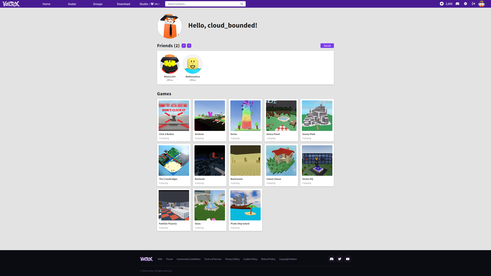
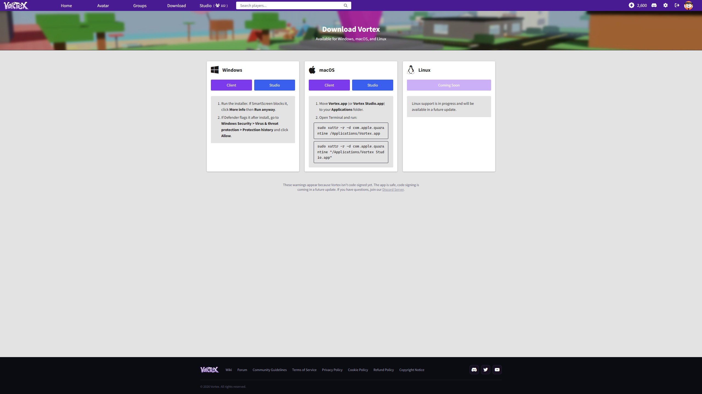
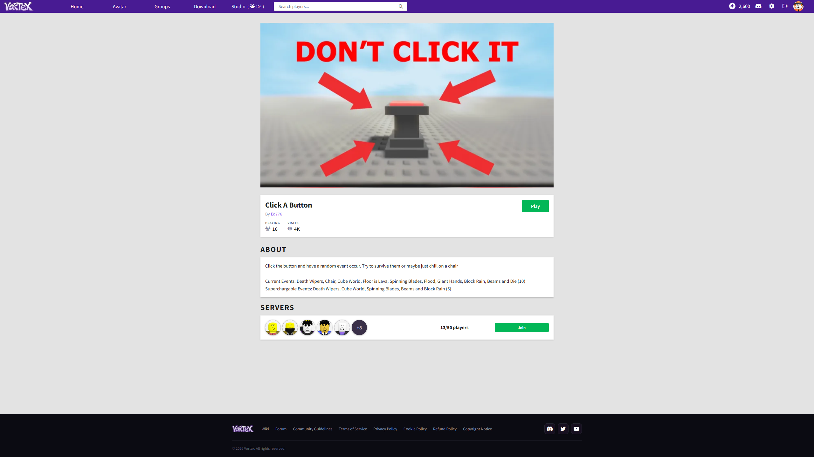
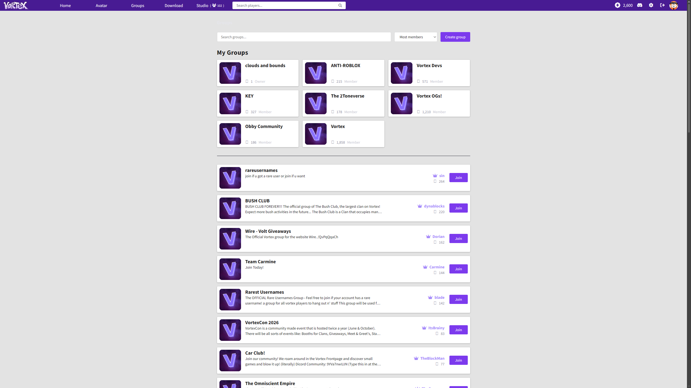
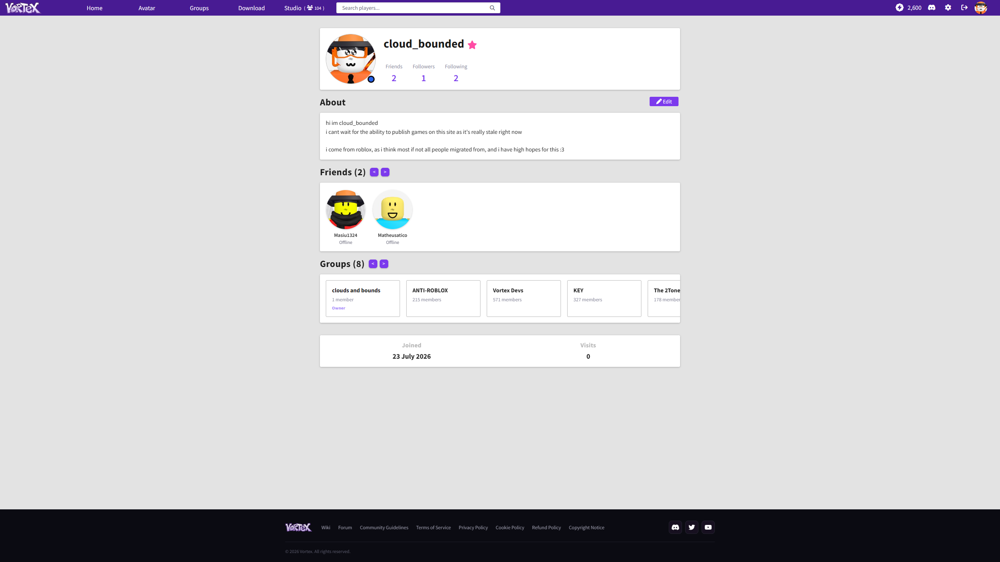
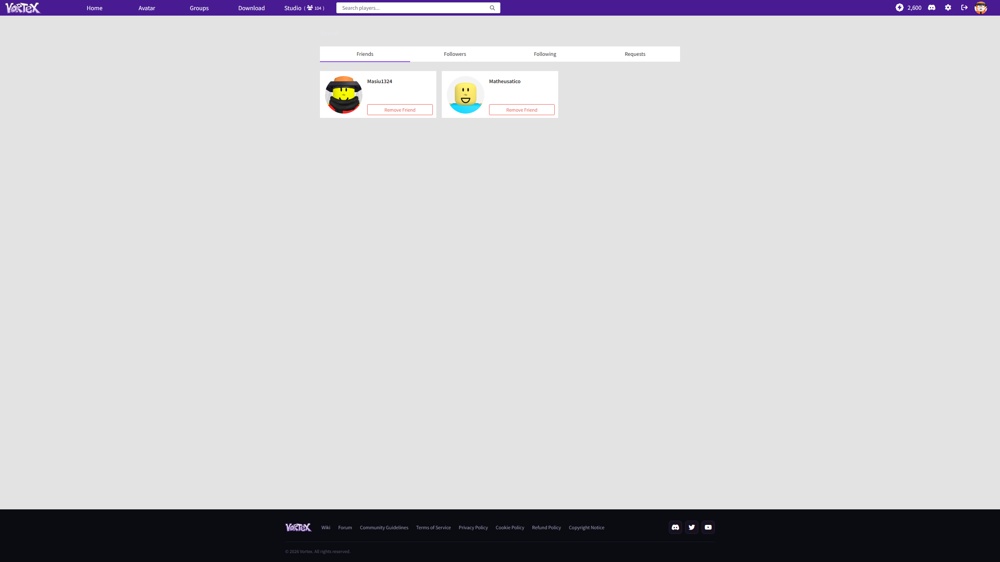
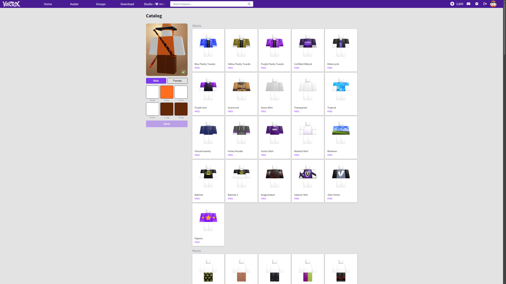
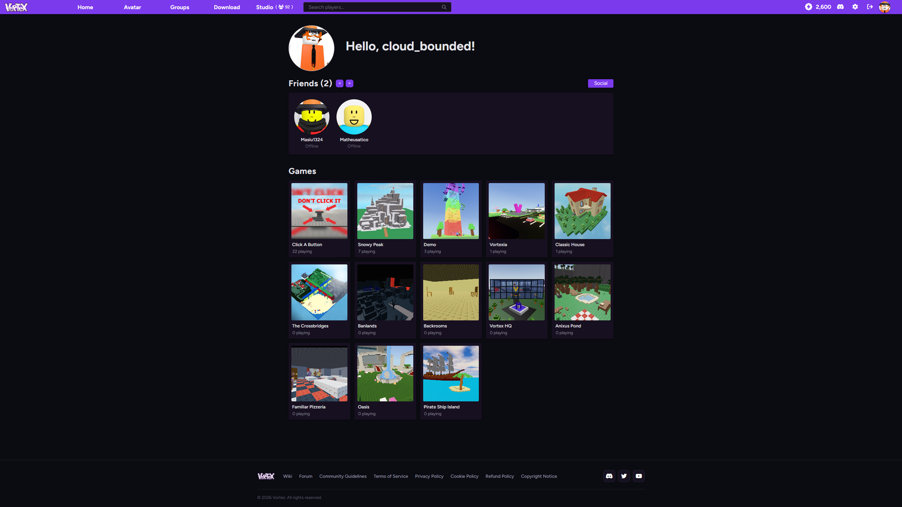
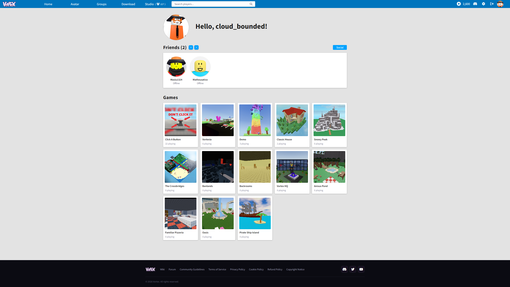

    

# VortBlox

**VortBlox** is a theme for [Vortex](https://playvortex.io) that uses [Stylus](https://add0n.com/stylus.html) to make the website look like the **2016–2017 Roblox website**.

## Features

Right now, there are four options:

- **Dark Mode**: A toggle between the original dark theme and a light theme.
- **Source-Sans Pro**: Use the original Roblox website font.
- **Blue Theme**: Use the original Roblox blue instead of the Vortex purple.
- **Currency Type**: A choice between the display of Volts, Robux and Tix.

## Installation

Installation is easy, simply follow the guide below.

1. Install [Stylus](https://add0n.com/stylus.html).
2. Install the [VortBlox theme](https://userstyles.world/style/30005/vortblox).
3. Configure using the Extension bar.
4. ggez.

## Previews

